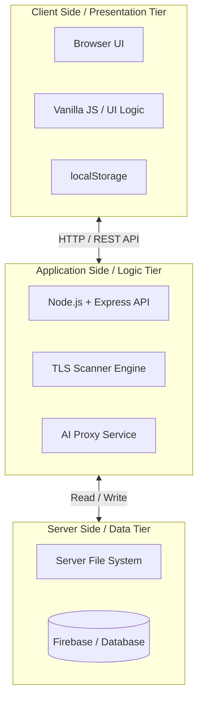

# QuantumGuard
A platform for quantum readiness assurance, vulnerability scanning, and compliance maturity.

Live Preview: [https://social-482013.web.app](https://social-482013.web.app)

## Table of Contents
- [Key Features](#key-features)
- [3-Tier Architecture](#3-tier-architecture)
- [System Requirements](#system-requirements)
- [Installation & Deployment](#installation--deployment)
- [Scoring Methodology](#scoring-methodology)
- [Documentation Hub](#documentation-hub)

## Key Features
1. **Maturity Assessment Engine**: Quick (12 questions) and Comprehensive (120 questions) assessments.
2. **Quantum Cryptography Scanners**: TLS Scanner, CryptoScan, and CryptoDeps for vulnerability analysis.
3. **CBOM Generator**: Generate Cryptographic Bills of Materials.
4. **Results & Compliance Dashboard**: NIST PQC, CMMC 2.0, FedRAMP, and FISMA mappings.
5. **AI Chat Advisor**: Integrated Gemini AI for cybersecurity advice.

## 3-Tier Architecture
QuantumGuard employs a highly modular, decoupled 3-Tier Architecture designed for enterprise scalability and security:



- **Presentation Tier**: HTML5, Tailwind CSS, Vanilla JS. (Client-side UI)
- **Application Tier**: Node.js & Express.js. (Business logic, TLS scanning, AI proxy)
- **Data Tier**: localStorage (Client), File System/Firebase (Server/Storage).

> **Read more:** [Detailed System Architecture](docs/01_System_Architecture.md)

## System Requirements
- **CPU**: Minimum 1 vCPU (1.0 GHz+)
- **RAM**: 512 MB (1 GB+ Recommended)
- **Storage**: 500 MB SSD
- **OS**: Ubuntu 24.04 LTS or Windows Server

> **Read more:** [Detailed System Requirements](docs/02_System_Requirements.md)

## Installation & Deployment
QuantumGuard runs as a full-stack Node.js application. 
```bash
npm install
npm run start
```
> **Read more:** [Detailed Installation & Deployment Guide](docs/05_Deployment_Guide.md)

## Scoring Methodology
Evaluates readiness across **4 Dimensions**: CVI (Visibility), SGRM (Governance), DPE (Data Protection), and ITR (Technical Readiness). 

- **Scoring Scale**: Each control is evaluated on a 1-4 scale (1 = Non-Existent, 4 = Quantum-Safe).
- **Weakest Link Principle**: A dimension's score is capped by its weakest controls, preventing artificially high averages.
- **Maturity Tiers**: Final scores (1.0 to 4.0) are mapped to a 5-level maturity tier (Basic to Optimizing) to gauge "Harvest Now, Decrypt Later" risk.

> **Read more:** [Scoring Methodology Details](docs/03_Scoring_Methodology.md)

## Documentation Hub
For highly detailed, professional documentation, please visit our `/docs` folder:
- [Architecture Details](docs/01_System_Architecture.md)
- [Hardware & Software Requirements](docs/02_System_Requirements.md)
- [Detailed Installation Guide](docs/05_Deployment_Guide.md)
- [Security & Privacy Posture](docs/04_Security_and_Privacy.md)
- [Development Roadmap](docs/06_Development_Roadmap.md)
