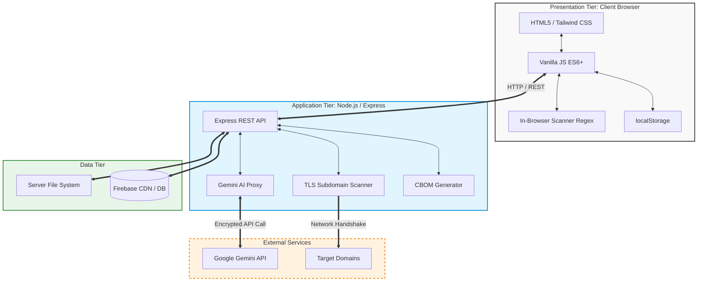

# 1. System Architecture

## 1.1 Architectural Overview
QuantumGuard is architected as a highly modular, decoupled **3-Tier Enterprise application**. It is specifically designed to provide high scalability, maintainability, and robust security for assessing post-quantum cryptography (PQC) readiness. The system evaluates cryptographic posture across application code, network endpoints, and dependencies, while securely leveraging AI for actionable insights.

---

## 1.2 The 3-Tier Architecture Deep Dive

### 1.2.1 Tier 1: Presentation Tier (Client Interface)
The Presentation Tier is strictly responsible for user interaction, visual rendering, and stateless session management. It is designed to run entirely within the end-user's browser, prioritizing speed and data sovereignty.

*   **Technologies & Frameworks**:
    *   HTML5 & CSS3 for semantic layout.
    *   **Vanilla JavaScript (ES6+)**: Ensures zero-dependency execution for maximum security and minimal overhead.
    *   **Tailwind CSS**: Utility-first CSS framework (loaded via CDN or compiled) for responsive, modern UI design.
    *   **Chart.js / Data Visualizers**: For rendering interactive CBOMs (Cryptographic Bill of Materials) and compliance dashboards.
*   **Core Responsibilities**:
    *   Rendering assessment forms (12-question and 120-question variants).
    *   Handling client-side input validation before any backend requests are made.
    *   Executing in-browser regex operations for the `CryptoScan` source code vulnerability scanner to ensure sensitive code never leaves the client's machine.
*   **State Management**:
    *   Utilizes the browser's `localStorage` API to maintain assessment progress and organizational profiles. This ensures that sensitive assessment data remains strictly on the client side unless explicitly exported.

### 1.2.2 Tier 2: Application Tier (Logic & API Gateway)
The Application Tier serves as the central processing engine and secure proxy for the platform. It handles complex computations, network scanning, and external API integrations.

*   **Technologies & Frameworks**:
    *   **Node.js (v18+)**: The asynchronous event-driven JavaScript runtime powering the backend.
    *   **Express.js**: The web application framework used to define RESTful API endpoints and middleware.
*   **Core Responsibilities**:
    *   **TLS Scanner Service**: Acts as an active network scanner. It takes target domains from the client, performs deep SSL/TLS handshakes, extracts certificate chains, and evaluates cipher suites for quantum vulnerability.
    *   **AI Proxy Service**: Securely bridges the gap between the Presentation Tier and the Google Gemini AI. It injects the `GEMINI_API_KEY` entirely server-side, preventing credential leakage to the public internet, and streams cybersecurity advice back to the client.
    *   **CBOM Engine**: Aggregates vulnerability findings, maps them to PQC standards, and generates standardized Cryptographic Bill of Materials (CBOM) data structures.
*   **Security Controls**:
    *   CORS (Cross-Origin Resource Sharing) policies.
    *   Environment variable isolation (using `.env`).
    *   Rate limiting to prevent abuse of the TLS scanner or AI proxy.

### 1.2.3 Tier 3: Data Tier (Storage & Persistence)
The Data Tier is responsible for the persistent storage of application assets, historical records, and overarching platform configurations.

*   **Technologies & Services**:
    *   **File System (Server-Side)**: Local disk storage for static assets, PDF templates, and temporary processing files.
    *   **Firebase Hosting (CDN)**: Used to globally distribute the static assets of the Presentation Tier for ultra-low latency access.
    *   **Optional Database Integrations (Firestore / PostgreSQL)**: While the base MVP relies on `localStorage` for privacy, the Data Tier is structured to seamlessly plug into Firebase Firestore or PostgreSQL for multi-tenant enterprise deployments (allowing teams to share historical scan reports and CBOMs).

---

## 1.3 System Data Flow & Interaction
1.  **Initialization**: The user accesses the platform (e.g., via `https://social-482013.web.app`). The Application Tier (or Firebase CDN) serves the Presentation Tier (HTML/JS/CSS).
2.  **Client-Side Execution**: The user conducts a maturity assessment. Data is actively written and read from the Data Tier's local manifestation (`localStorage`).
3.  **Active Scanning**: The user requests a TLS scan. The Presentation Tier dispatches an asynchronous `fetch()` request to the Application Tier's Express endpoints (`/api/tls-scan`).
4.  **Backend Processing**: The Application Tier executes network-level commands against the target domain, processes the raw cryptographic data, and formats a JSON response.
5.  **AI Augmentation**: If the user queries the AI Advisor, the Application Tier securely authenticates with Google Cloud, retrieves the Gemini response, and streams it back.
6.  **Visualization**: The Presentation Tier ingests the JSON responses and dynamically updates the DOM, rendering interactive charts and compliance mappings.
