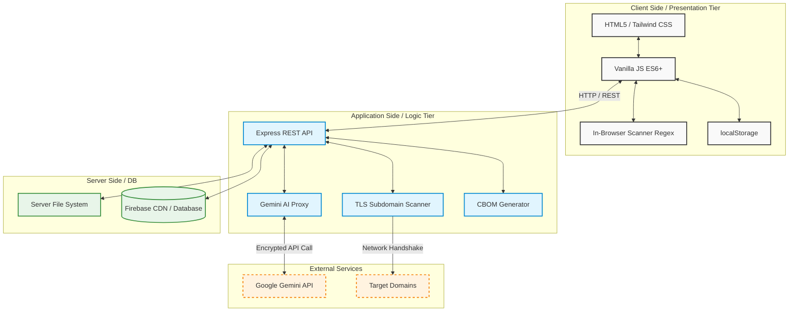

# 1. System Architecture

## 1.1 Architectural Overview
QuantumGuard is architected as a highly modular, decoupled **3-Tier Enterprise application**. It is specifically designed to provide high scalability, maintainability, and robust security for assessing post-quantum cryptography (PQC) readiness. The system evaluates cryptographic posture across application code, network endpoints, and dependencies, while securely leveraging AI for actionable insights.

---

## 1.2 The 3-Tier Architecture Deep Dive

### 1.2.1 Tier 1: Presentation Tier (Client Interface)
The Presentation Tier is strictly responsible for user interaction, visual rendering, and stateless session management. It is designed to run entirely within the end-user's browser, prioritizing speed and data sovereignty.

*   **Technologies & Frameworks**:
    *   HTML5 & CSS3 for semantic layout.
    *   **Vanilla JavaScript (ES6+)**: Ensures zero-dependency execution for maximum security and minimal overhead.
    *   **Tailwind CSS**: Utility-first CSS framework (loaded via CDN or compiled) for responsive, modern UI design.
    *   **Chart.js / Data Visualizers**: For rendering interactive CBOMs (Cryptographic Bill of Materials) and compliance dashboards.
*   **Core Responsibilities**:
    *   Rendering assessment forms (12-question and 120-question variants).
    *   Handling client-side input validation before any backend requests are made.
    *   Executing in-browser regex operations for the `CryptoScan` source code vulnerability scanner to ensure sensitive code never leaves the client's machine.
*   **State Management**:
    *   Utilizes the browser's `localStorage` API to maintain assessment progress and organizational profiles. This ensures that sensitive assessment data remains strictly on the client side unless explicitly exported.

### 1.2.2 Tier 2: Application Tier (Logic & API Gateway)
The Application Tier serves as the central processing engine and secure proxy for the platform. It handles complex computations, network scanning, and external API integrations.

*   **Technologies & Frameworks**:
    *   **Node.js (v18+)**: The asynchronous event-driven JavaScript runtime powering the backend.
    *   **Express.js**: The web application framework used to define RESTful API endpoints and middleware.
*   **Core Responsibilities**:
    *   **TLS Scanner Service**: Acts as an active network scanner. It takes target domains from the client, performs deep SSL/TLS handshakes, extracts certificate chains, and evaluates cipher suites for quantum vulnerability.
    *   **AI Proxy Service**: Securely bridges the gap between the Presentation Tier and the Google Gemini AI. It injects the `GEMINI_API_KEY` entirely server-side, preventing credential leakage to the public internet, and streams cybersecurity advice back to the client.
    *   **CBOM Engine**: Aggregates vulnerability findings, maps them to PQC standards, and generates standardized Cryptographic Bill of Materials (CBOM) data structures.
*   **Security Controls**:
    *   CORS (Cross-Origin Resource Sharing) policies.
    *   Environment variable isolation (using `.env`).
    *   Rate limiting to prevent abuse of the TLS scanner or AI proxy.

### 1.2.3 Tier 3: Data Tier (Storage & Persistence)
The Data Tier is responsible for the persistent storage of application assets, historical records, and overarching platform configurations.

*   **Technologies & Services**:
    *   **File System (Server-Side)**: Local disk storage for static assets, PDF templates, and temporary processing files.
    *   **Firebase Hosting (CDN)**: Used to globally distribute the static assets of the Presentation Tier for ultra-low latency access.
    *   **Optional Database Integrations (Firestore / PostgreSQL)**: While the base MVP relies on `localStorage` for privacy, the Data Tier is structured to seamlessly plug into Firebase Firestore or PostgreSQL for multi-tenant enterprise deployments (allowing teams to share historical scan reports and CBOMs).

---

## 1.3 Detailed Workflow, Data Flow, and Conversions

This section breaks down the step-by-step execution and data conversion processes for the platform's core features, mapping how data moves between the Presentation, Application, and Server Tiers.

### 1.3.1 The Assessment Lifecycle & Scoring Conversion
1. **User Input Phase (Client Side)**: The user interacts with the Presentation Tier (HTML/JS), answering maturity questions via radio buttons (mapped to numerical values 1-4).
2. **State Storage (Data Tier)**: The Vanilla JS logic serializes the active form data into a JSON string and saves it to the local Data Tier (`localStorage`). This ensures persistence without requiring a backend database round-trip.
3. **Scoring Engine Conversion**:
   - The JS logic retrieves and parses the raw JSON object.
   - It iterates through the answers, grouping them by the 4 core dimensions (CVI, SGRM, DPE, ITR).
   - It applies the mathematical weighting formula (sum of scores / max possible score * 4.0).
   - The numerical output is converted into a qualitative "Maturity Tier" string (e.g., a score of 2.3 converts to "Tier 2 - Developing").
4. **Visualization**: The resulting metrics are passed into Chart.js objects, converting numerical arrays into graphical radar and bar charts rendered on the DOM.

### 1.3.2 TLS Subdomain Scan & Protocol Conversion
1. **Request Dispatch**: The user enters a target URL. The client-side JS constructs a JSON payload and dispatches an asynchronous `POST` request to the Application Tier (`/api/tls-scan`).
2. **Network Handshake (Application Side)**: 
   - The Node.js Express server receives the request.
   - It utilizes the native Node.js `tls` module to initiate raw TCP/TLS handshakes against the target external domain.
   - It iterates through specific protocol versions (TLS 1.0, 1.1, 1.2, 1.3) and extracts the raw X.509 certificates and negotiated cipher suites.
3. **Vulnerability Conversion**:
   - The backend takes the raw cryptographic certificate data (buffer streams) and converts it into structured, human-readable JSON (Subject, Issuer, Expiry).
   - It evaluates the key exchange algorithms against a hardcoded list of PQC indicators (e.g., scanning for "kyber" or "dilithium" strings).
   - A numerical "Quantum Score" is mathematically derived based on the presence of weak ciphers (e.g., RC4, DES) and the absence of PQC key exchanges.
4. **Response & Rendering**: The finalized JSON object is sent back to the Presentation Tier, where DOM manipulation converts the JSON array into an interactive HTML table.

### 1.3.3 AI Advisor Context Conversion
1. **Context Aggregation (Client Side)**: When the user asks a cybersecurity question, the client JS aggregates their current assessment scores and the latest TLS scan results into a unified, minimized context string.
2. **Proxy Submission**: The client sends the user's prompt alongside the context string to the Application Tier (`/api/chat`).
3. **Gemini API Conversion (Application Side)**: 
   - The Node.js server acts as a secure proxy. It injects the `GEMINI_API_KEY` (loaded from `.env`), converting the standard HTTP request into an authenticated stream via the Google GenAI SDK.
   - The server truncates the context if it exceeds token limits (e.g., capping at 8000 characters) to prevent API rejection.
4. **Response Streaming**: The Application Tier receives a chunked data stream from Gemini. It pipes this stream directly back to the client as plain text via the `res.write()` stream. The client receives the stream and converts it to HTML/Markdown on the fly for dynamic typing effects.

### 1.3.4 Cryptographic Bill of Materials (CBOM) Generation
1. **Data Unification**: The CBOM generator acts as a conversion engine. It reads the raw assessment data (from `localStorage`) and the structured network scan data (from the Application Tier's Express API responses).
2. **Format Conversion**: It maps these disparate data structures into a standardized JSON CBOM schema, categorizing assets into hardware, software, and network keys.
3. **Export Process**: The Presentation Tier utilizes JavaScript `Blob` objects to convert the JSON memory structure into a downloadable `.json` file, effectively moving data from volatile browser memory to the user's local file system.
