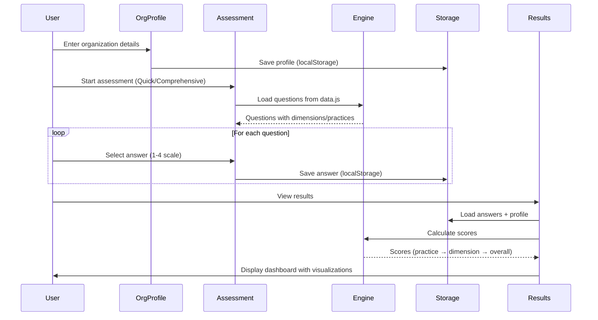
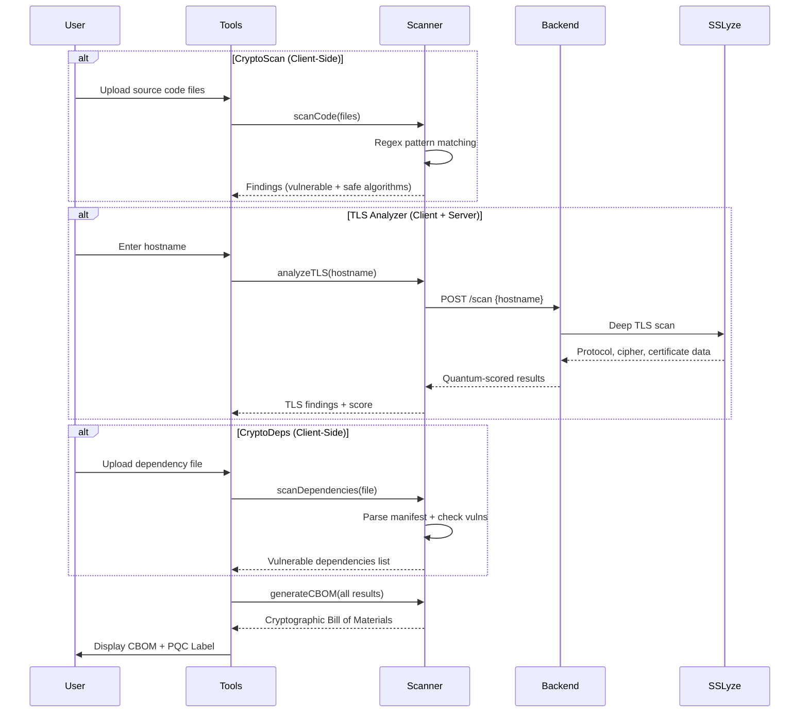

# QuantumGuard — System Architecture

> **Project**: QuantumGuard – Quantum Readiness Assurance Maturity Model (QRAMM)  
> **Version**: 1.0  
> **Date**: June 2026  
> **Team**: IravoVoid

---

## 1. Architecture Overview

QuantumGuard follows a **decoupled client-server architecture** with a statically deployed frontend and an optional self-hosted Python backend. The system is designed for maximum portability — the core assessment engine runs entirely in the browser, while advanced TLS scanning capabilities require the backend service.

```
┌─────────────────────────────────────────────────────────────────────┐
│                        CLIENT LAYER (Browser)                       │
│                                                                     │
│  ┌─────────────┐  ┌──────────────┐  ┌───────────────────────────┐  │
│  │  Assessment  │  │   Results    │  │   Scanner Tools           │  │
│  │   Module     │  │  Dashboard   │  │  (CryptoScan / TLS /      │  │
│  │             │  │              │  │   CryptoDeps / CBOM)       │  │
│  └──────┬──────┘  └──────┬───────┘  └────────────┬──────────────┘  │
│         │                │                        │                 │
│  ┌──────▼────────────────▼────────────────────────▼──────────────┐  │
│  │                   Core Engine Layer                           │  │
│  │  data.js (Questions, Frameworks) │ engine.js (Scoring)       │  │
│  │  scanner-engine.js (Analysis)    │ ui-utils.js (UI Helpers)  │  │
│  └──────────────────────┬───────────────────────────────────────┘  │
│                         │                                          │
│  ┌──────────────────────▼───────────────────────────────────────┐  │
│  │              Browser localStorage                            │  │
│  │  qg_orgProfile │ qg_quick_answers │ qg_comprehensive_answers │  │
│  └──────────────────────────────────────────────────────────────┘  │
└─────────────────────────┬───────────────────────────────────────────┘
                          │ HTTPS / fetch()
                          │ (Optional — only for deep TLS scanning)
┌─────────────────────────▼───────────────────────────────────────────┐
│                    SERVER LAYER (Self-Hosted)                        │
│                                                                     │
│  ┌──────────────────┐  ┌────────────────┐  ┌────────────────────┐  │
│  │  Flask API        │  │ SSLyze Scanner │  │ Gemini AI Chat     │  │
│  │  (tls_api_server) │  │ (sslyze_scanner│  │ (chat_advisor)     │  │
│  │  :5000            │  │  .py)          │  │                    │  │
│  └──────────────────┘  └────────────────┘  └────────────────────┘  │
│                                                                     │
│  Python 3.10+ │ Flask │ SSLyze │ Google Gemini API                  │
└─────────────────────────────────────────────────────────────────────┘
                          │
┌─────────────────────────▼───────────────────────────────────────────┐
│                    DEPLOYMENT LAYER                                  │
│                                                                     │
│  ┌──────────────────────────────┐  ┌────────────────────────────┐  │
│  │ Vercel (Static Frontend)     │  │ Local / Cloud (Backend)    │  │
│  │ • URL Rewrites               │  │ • Docker / Direct          │  │
│  │ • Security Headers           │  │ • Google Cloud Run         │  │
│  │ • CDN Edge Caching           │  │ • AWS ECS / Azure ACI      │  │
│  └──────────────────────────────┘  └────────────────────────────┘  │
└─────────────────────────────────────────────────────────────────────┘
```

---

## 2. Component Architecture

### 2.1 Frontend Components

| Component | File(s) | Responsibility |
|---|---|---|
| **Landing Page** | `index.html` | Hero section, feature showcase, entry point |
| **Organization Profile** | `org-profile.html` | Collect org metadata, compute risk multiplier |
| **Quick Assessment** | `quick-assessment.html` | 12-question rapid maturity assessment |
| **Comprehensive Assessment** | `comprehensive-assessment.html` | Full 120-question assessment across 4 dimensions |
| **Results Dashboard** | `results.html` | Score visualization, maturity breakdown, export |
| **Compliance Mapping** | `compliance.html` | Framework-to-practice compliance mapping |
| **Scanner Tools** | `tools.html` | CryptoScan, TLS Analyzer, CryptoDeps, CBOM |
| **Documentation** | `docs.html` | User guides and methodology documentation |
| **About** | `about.html` | Team and project information |
| **Leaderboard** | `leaderboard.html` | Organization ranking and comparison |

### 2.2 Core JavaScript Modules

| Module | Purpose | Key Exports |
|---|---|---|
| **`data.js`** | Data layer containing all 120 questions, 4 dimensions, 12 practices, maturity levels, compliance framework mappings | `QG.QUESTIONS`, `QG.DIMENSIONS`, `QG.PRACTICES`, `QG.COMPLIANCE_FRAMEWORKS` |
| **`engine.js`** | Scoring engine implementing the QRAMM methodology | `Engine.calculate()`, `Engine.getMaturityLevel()`, `Engine.getRecommendation()` |
| **`scanner-engine.js`** | Cryptographic scanning and analysis engine | `Scanner.scanCode()`, `Scanner.analyzeTLS()`, `Scanner.scanDependencies()`, `Scanner.generateCBOM()` |
| **`ui-utils.js`** | Shared UI utilities (navigation, notifications, charts) | `Navigation`, `Charts`, `Toast` |
| **`tailwind-config.js`** | Centralized Tailwind CSS theme configuration | Custom colors, fonts, design tokens |
| **`shared.css`** | Design system CSS with custom properties and animations | Glass-morphism, gradients, transitions |

### 2.3 Backend Services

| Service | File | API Endpoint | Purpose |
|---|---|---|---|
| **TLS API Server** | `tls_api_server.py` | `POST /scan` | Orchestrates SSLyze scans with subdomain discovery |
| **SSLyze Scanner** | `sslyze_scanner.py` | (internal) | Deep TLS/SSL analysis with quantum scoring |
| **Chat Advisor** | `chat_advisor.py` | `POST /chat` | Gemini AI-powered security advisory |
| **Subdomain Discovery** | `subdomain_discovery.py` | (internal) | DNS enumeration for comprehensive scanning |

---

## 3. Data Flow Architecture

### 3.1 Assessment Flow



### 3.2 Scanner Flow



### 3.3 Scoring Pipeline

```
┌──────────────────────────────────────────────────────────────┐
│                    SCORING PIPELINE                           │
│                                                              │
│  Questions (120)                                             │
│       │                                                      │
│       ▼                                                      │
│  ┌─────────────────────────────────────────────────────┐    │
│  │ Practice Score = AVERAGE(question scores in practice)│    │
│  │ 12 practices × 10 questions each                    │    │
│  └──────────────────────┬──────────────────────────────┘    │
│                         │                                    │
│                         ▼                                    │
│  ┌─────────────────────────────────────────────────────┐    │
│  │ Dimension Score = MIN(practice scores in dimension)  │    │
│  │ 4 dimensions × 3 practices each                     │    │
│  │ (Weakest-link model — security chain principle)      │    │
│  └──────────────────────┬──────────────────────────────┘    │
│                         │                                    │
│                         ▼                                    │
│  ┌─────────────────────────────────────────────────────┐    │
│  │ Overall Score = AVERAGE(dimension scores)            │    │
│  │ Adjusted by Risk Multiplier (1.0–1.5×)              │    │
│  └──────────────────────┬──────────────────────────────┘    │
│                         │                                    │
│                         ▼                                    │
│  ┌─────────────────────────────────────────────────────┐    │
│  │ Maturity Level Mapping                               │    │
│  │ 1.0–1.4 Basic │ 1.5–2.4 Developing │ 2.5–3.4 Est.  │    │
│  │ 3.5–3.9 Advanced │ 4.0 Optimizing                   │    │
│  └─────────────────────────────────────────────────────┘    │
└──────────────────────────────────────────────────────────────┘
```

---

## 4. Technology Stack

### 4.1 Frontend Stack

| Technology | Version | Purpose |
|---|---|---|
| HTML5 | - | Page structure (no framework, no build step) |
| CSS3 | - | Styling with custom properties |
| Tailwind CSS | 3.x (CDN) | Utility-first CSS framework |
| Vanilla JavaScript | ES6+ | All client-side logic |
| Material Symbols | Outlined | Icon library (Google Fonts) |
| Inter / Space Grotesk / JetBrains Mono | - | Typography |
| html2pdf.js | 0.10.1 (CDN) | PDF report generation |
| localStorage API | - | Client-side data persistence |

### 4.2 Backend Stack

| Technology | Version | Purpose |
|---|---|---|
| Python | 3.10+ | Runtime |
| Flask | ≥ 3.0.0 | REST API framework |
| Flask-CORS | ≥ 4.0.0 | Cross-origin resource sharing |
| SSLyze | ≥ 6.0.0 | TLS/SSL scanning engine |
| cryptography | (via SSLyze) | Certificate parsing |
| requests | ≥ 2.31.0 | HTTP client for Gemini API |
| Google Gemini 1.5 Flash | API | AI-powered security chat advisor |

### 4.3 Deployment Stack

| Platform | Purpose |
|---|---|
| Vercel | Static frontend deployment with CDN |
| Docker | Backend containerization |
| Google Cloud Run | Serverless backend hosting (optional) |

---

## 5. Security Architecture

### 5.1 Security Headers (Vercel)

| Header | Value | Purpose |
|---|---|---|
| `X-Content-Type-Options` | `nosniff` | Prevents MIME-type sniffing |
| `X-Frame-Options` | `DENY` | Prevents clickjacking |
| `Referrer-Policy` | `strict-origin-when-cross-origin` | Controls referrer information |

### 5.2 Data Security

- **No server-side storage for assessment data** — all scores remain in the user's browser
- **HTTPS enforced** for all Vercel deployments
- **No PII collection** — organization profiles are optional and stored locally
- **CORS restricted** on backend API endpoints

### 5.3 Scanner Security

- **SSRF Prevention**: Backend validates hostnames against internal network blocklists
- **Rate Limiting**: TLS scans are resource-intensive and rate-limited
- **Input Sanitization**: All user inputs validated before processing

---

## 6. Directory Structure

```
Quantum-Guard/
├── implementation/
│   ├── frontend/                    # Static frontend application
│   │   ├── index.html               # Landing page
│   │   ├── quick-assessment.html    # 12-question quick assessment
│   │   ├── comprehensive-assessment.html  # 120-question full assessment
│   │   ├── results.html             # Results dashboard
│   │   ├── compliance.html          # Compliance mapping
│   │   ├── tools.html               # Scanner tools (CryptoScan/TLS/CryptoDeps)
│   │   ├── org-profile.html         # Organization profile setup
│   │   ├── leaderboard.html         # Organization rankings
│   │   ├── docs.html                # Documentation
│   │   ├── about.html               # About page
│   │   ├── data.js                  # Questions, dimensions, practices, frameworks
│   │   ├── engine.js                # Scoring engine
│   │   ├── scanner-engine.js        # Crypto scanner engine
│   │   ├── ui-utils.js              # Shared UI utilities
│   │   ├── tailwind-config.js       # Tailwind CSS configuration
│   │   ├── shared.css               # Design system styles
│   │   └── test-data/               # Sample files for scanner testing
│   │       ├── cryptoscan/          # Source code samples
│   │       └── cryptodeps/          # Dependency manifest samples
│   └── backend/                     # Python Flask backend
│       ├── main.py                  # Entry point
│       ├── tls_api_server.py        # Flask API server
│       ├── sslyze_scanner.py        # SSLyze wrapper
│       ├── chat_advisor.py          # Gemini AI chat
│       ├── subdomain_discovery.py   # DNS enumeration
│       ├── requirements.txt         # Python dependencies
│       └── Dockerfile               # Container definition
├── framework/                       # QRAMM framework documentation
├── toolkit/                         # Excel assessment toolkit
├── toolkit-specs/                   # Technical specifications
├── templates/                       # Report templates
├── assets/                          # Visual assets and screenshots
├── docs/                            # Project documentation
│   ├── system_architecture.md       # This file
│   └── minimum_hardware_software_requirement.md
├── vercel.json                      # Vercel deployment configuration
├── README.md                        # Project README
└── LICENSE                          # MIT License
```

---

## 7. Key Design Decisions

| Decision | Rationale |
|---|---|
| **No frontend framework** | Zero build complexity, instant deployment, easy to audit |
| **Client-side scoring** | No server needed for core functionality, enables static deployment |
| **localStorage persistence** | No database required, privacy-preserving (data stays on user's device) |
| **Weakest-link dimension scoring** | A chain is only as strong as its weakest link; quantum readiness requires all areas to be adequate |
| **Regex-based crypto scanning** | Lightweight, runs in-browser, covers common patterns across 6+ languages |
| **Optional backend** | Deep TLS scanning via SSLyze requires server-side execution, but basic TLS checks work client-side |
| **Tailwind CDN** | No build step required, rapid prototyping, consistent design system |

---

## 8. API Reference

### 8.1 Backend API Endpoints

| Method | Endpoint | Description | Auth |
|---|---|---|---|
| `POST` | `/scan` | Initiate TLS scan for a hostname | None (open) |
| `POST` | `/chat` | Send message to AI chat advisor | None (open) |
| `GET`  | `/health` | Health check endpoint | None |

### 8.2 Scan Request/Response

**Request:**
```json
{
  "hostname": "example.com",
  "port": 443,
  "scan_subdomains": true
}
```

**Response:**
```json
{
  "domain": "example.com",
  "main_domain": {
    "hostname": "example.com",
    "status": "completed",
    "quantum_score": 45,
    "tls_versions": ["TLSv1.2", "TLSv1.3"],
    "cipher_suites": [...],
    "certificate": {...},
    "vulnerabilities": [...]
  },
  "subdomains": [...],
  "summary": {
    "total_hosts_scanned": 5,
    "active_hosts": 4,
    "average_quantum_score": 42,
    "critical_vulnerabilities": 2
  }
}
```
